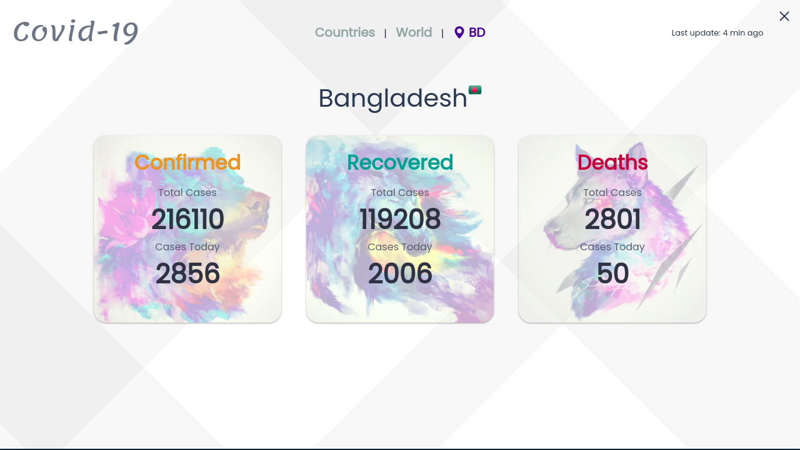
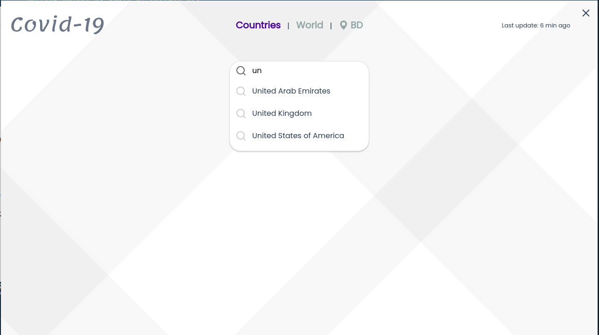
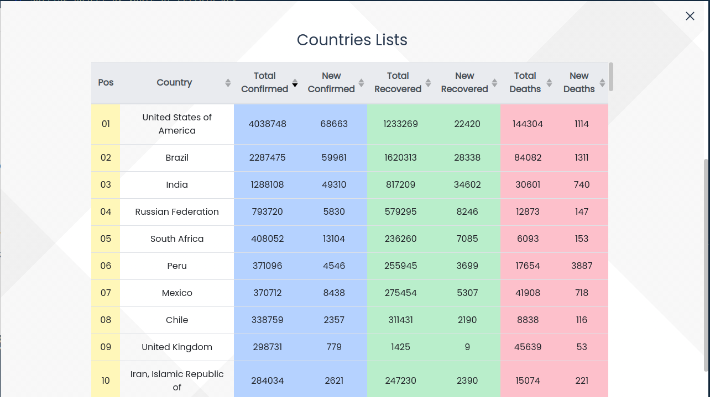

# covid-19

A stat app for covid-19 stat

## Project setup

```
yarn install
```

### Compiles and hot-reloads for development

```
yarn run electron:serve
```

### Compiles and minifies for production

```
yarn run electron:build
```

## Some Screenshots





### Customize configuration

See [Configuration Reference](https://cli.vuejs.org/config/).
